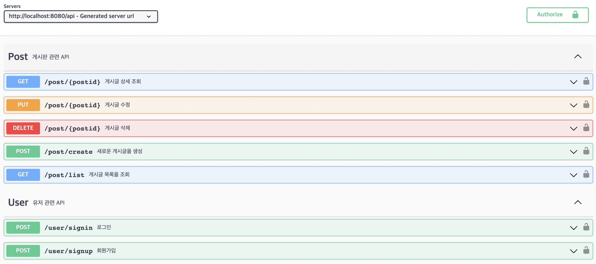
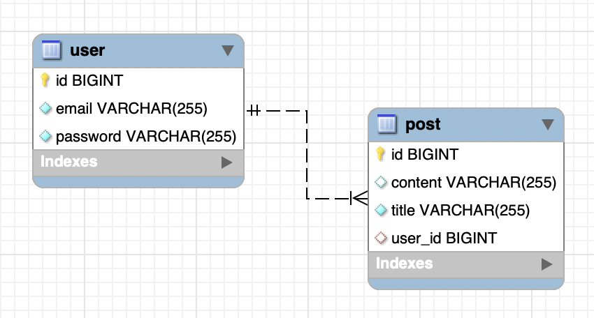
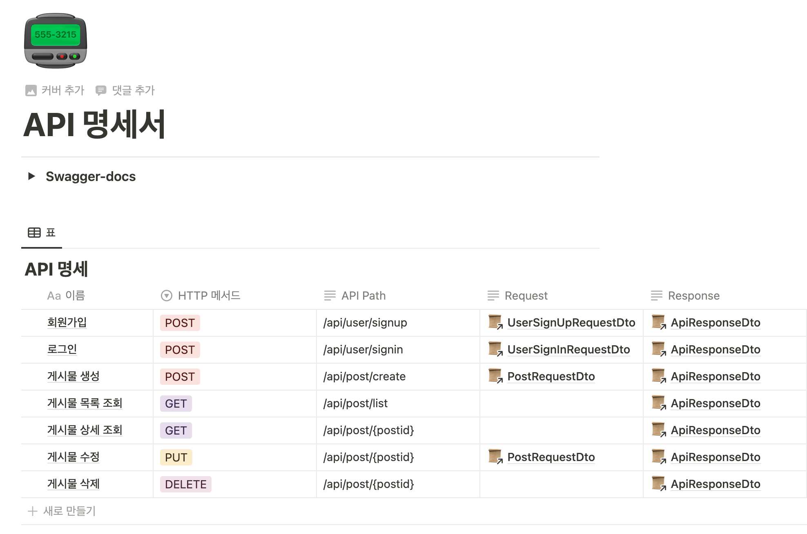

# wanted-pre-onboarding-backend
원티드 프리온보딩 백엔드 인턴십 - 선발 과제

   

## 지원자의 성명
### 이원석

   

## 애플리케이션의 실행 방법 (엔드포인트 호출 방법 포함)

Main class인 BackendApplication을 통해 빌드를 시작하여 어플리케이션을 실행합니다. 기본 로컬환경의 8080 port를 사용하며, Database는 MySQL 8.0 버전의 기본 포트 3306을 사용합니다. 엔드포인트 호출 방법으로는 PostMan을 사용하는 방법과 Swagger-docs를 사용하는 방법이 있습니다.
본 과제에서는 Swagger-docs를 사용하였습니다.

 

#### Swagger-docs
1. http://localhost:8080/api/swagger-ui/index.html? URL에 접속.
2. 검색창에 /api/ 를 입력한 뒤에 explore를 클릭.
3. 엔드포인트 호출

   

## 데이터베이스 테이블 구조

   

## 구현한 API의 동작을 촬영한 데모 영상 링크
https://youtu.be/2LmmNCnLLsg
   

## 구현 방법 및 이유에 대한 간략한 설명
---
### 과제 1. 사용자 회원가입 엔드포인트
요청받은 email과 password를 담은 DTO에 대해 유효성 검사를 진행합니다.  
적합하지 못할경우 예외처리, 적합한 경우 회원가입을 진행합니다. 보안성을 높이기 위해 SpringSecurity의 passwordEncoder를 빈으로 등록,주입받아 사용자의 비밀번호 암호화를 진행합니다.
  

### 과제 2. 사용자 로그인 엔드포인트
요청받은 email과 password를 담은 DTO를 통해 회원정보가 존재하는지, 비밀번호가 일치하는지 여부를 판단합니다. 문제가 없다면 빈으로 등록,주입받은 jwtTokenProvider를 통해 토큰을 발급합니다.
  

### 과제 3. 새로운 게시글을 생성하는 엔드포인트
요청받은 title과 content를 담은 DTO를 통해 새로운 게시물을 생성합니다. 
로그인시 발급된 토큰을 기준으로 @AuthenticationPrincipal을 통해 현재 인증된 사용자의 정보를 가져오고, 인증되지 않았을 경우 게시물 등록 자격이 없다고 판단하여 return 합니다.
  

### 과제 4. 게시글 목록을 조회하는 엔드포인트
요청받은 page, size 파라미터를 통해 Pageable 객체를 생성합니다. 그 후, Pageable을 활용하여 페이지네이션 한 게시물 목록을 조회합니다.
  

### 과제 5. 특정 게시글을 조회하는 엔드포인트
요청받은 postid 파라미터를 통해 게시물을 조회합니다. 
  

### 과제 6. 특정 게시글을 수정하는 엔드포인트
요청받은 title과 content를 담은 DTO와 postid 파라미터를 통해 게시물을 수정합니다.
 
게시물의 작성자만 게시물을 수정할 수 있기 때문에, 토큰을 통해 인증받은 회원과 게시물을 등록한 회원을 비교하여 검증합니다. 검증이 완료되었다면 게시물을 수정합니다.
  

### 과제 7. 특정 게시글을 삭제하는 엔드포인트
요청받은 postid 파라미터를 통해 게시물을 삭제합니다. 
 
게시물의 작성자만 게시물을 삭제할 수 있기 때문에, 토큰을 통해 인증받은 회원과 게시물을 등록한 회원을 비교하여 검증합니다. 검증이 완료되었다면 게시물을 삭제합니다.
  

### 추가 과제 1. 단위/통합 테스트
라이브러리 형태로 제공되는 테스팅 프레임워크인 JUnit5를 사용하여 단위 테스트를 진행했습니다.

   

## API 명세(request/response 포함)

https://alert-burn-c18.notion.site/API-4a4db41524164918b45cc3052aa4b6f5?pvs=4
 
 

